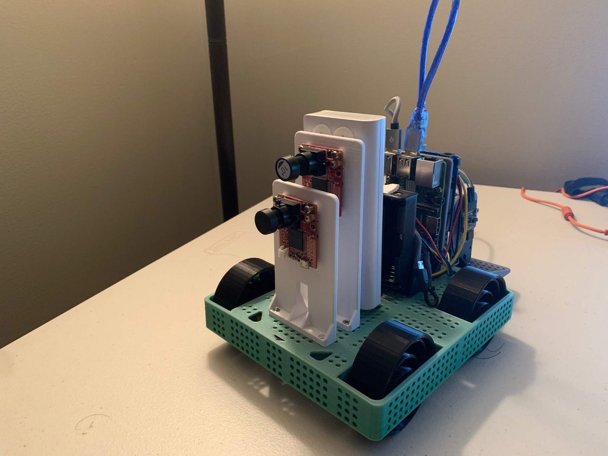

<!-- PROJECT SHIELDS -->
<!--
*** https://www.markdownguide.org/basic-syntax/#reference-style-links
-->

[![GPLv3 License][license-shield]][license-url]


<!-- PROJECT LOGO -->
<br />
<p align="center">
  <a href="https://github.com/lucastliu/sciencebot">
    
  </a>

  <h3 align="center">sciencebot</h3>

  <p align="center">
    A modular low-cost research vehicle platform
    <br />
    <a href="https://github.com/lucastliu/sciencebot"><strong>Explore the docs »</strong></a>
    <br />
    <br />
    <a href="https://github.com/lucastliu/sciencebot">View Demo</a>
    ·
    <a href="https://github.com/lucastliu/sciencebot/issues">Request Feature</a>
  </p>
</p>


<!-- TABLE OF CONTENTS -->
## Table of Contents

- [Table of Contents](#table-of-contents)
- [About The Project](#about-the-project)
- [Software Technologies](#software-technologies)
- [Project Structure](#project-structure)
- [Getting Started](#getting-started)
  * [Prerequisites](#prerequisites)
    + [Raspberry Pi](#raspberry-pi)
    + [BNO055 IMU](#bno055-imu)
    + [DWM1001](#dwm1001)
    + [OpenMV Cam H7 (Optional)](#openmv-cam-h7--optional-)
    + [Arduino](#arduino)
    + [ROS2 Eloquent Elusor](#ros2-eloquent-elusor)
  * [Installation](#installation)
- [Usage](#usage)
  * [Spin up](#spin-up)
  * [turtlesim basic](#turtlesim-basic)
  * [turtlesim PID control](#turtlesim-pid-control)
  * [sciencebot](#sciencebot)
- [Tuning, Modifying, & Additions](#tuning--modifying----additions)
- [Helpful Tips](#helpful-tips)
- [Resources](#resources)
- [Future](#future)
- [Contributing](#contributing)
- [License](#license)
- [Contact](#contact)
- [Acknowledgements](#acknowledgements)


<!-- ABOUT THE PROJECT -->
## About The Project

[![Product Name Screen Shot][product-screenshot]](https://example.com)

## Software Technologies

* Raspbian Buster OS
* Arduino
* Python
* C++
* ROS2 Eloquent Elusor


## Project Structure
The `dev_ws` folder contains a full ROS2 based implementation of the vehicle control project.

within `dev_ws`, source code is organized into packages under the `src` folder

Other folders contain basic standalone scripts for individual components (not tied to ROS2 in any way).

See seperate [Hardware Documentation](https://github.com/lucastliu/sciencebot/HARDWARE.md) for details on the physical vehicle build, and sensor information

<!-- GETTING STARTED -->
## Getting Started

### Prerequisites


#### Raspberry Pi

  This project was developed on a Raspberry Pi 3B+ running Raspian Buster. Setups that use other Pi hardware or OS versions, or even other Linux devices, will likely operate in a highly similar fashion, but not in the exact same manner.

0. Python 3

    This project requires Python 3. This should be available by default on the Pi with Raspbian Buster.

1. Storage

    Running with Raspbian Buster, the minimum SD card size is 8 GB. However, running this project will require more resources, and a 16 GB card was found to be inadequate as well. A `64 GB micro SD` was used in the build, and is easily sufficient.

2. Virtual Memory

    Due to the limited abilites of an RPi, during installation, it is often useful / necessary to leverage [swap space](https://access.redhat.com/documentation/en-us/red_hat_enterprise_linux/5/html/deployment_guide/ch-swapspace) . This can be achieved by editing the file `/etc/dphys-swapfile`, increasing the `CONF_SWAPSIZE` variable (`1024` seems to be sufficient). Full discussion for RPi 3 B+ can be found [here](https://www.raspberrypi.org/forums/viewtopic.php?t=211804)

3. Remote Access

    This step is optional, but highly recommended. The Pi supports HDMI output, but a wired connection is quite cumbersome, especially for a moving vehicle. There are several options for remote access, one of which is as follows.

    Virtual Network Computing (VNC) will allow one to view and control the Pi from another device wirelessly. Raspbian comes with a native / pre-installed VNC. Full instructions here: [VNC](https://www.raspberrypi.org/documentation/remote-access/vnc/)

    
    You will want to [setup a static IP Address](https://pimylifeup.com/raspberry-pi-static-ip-address/) as well.

    If the resulting resolution on your host device does not look right, you may need to [adjust the resolution](https://help.realvnc.com/hc/en-us/articles/360002249917-VNC-Connect-and-Raspberry-Pi#troubleshooting-vnc-server-0-7).

#### BNO055 IMU

  Communicating with the IMU is done through the [Adafruit_CircuitPython_BNO055 Library](https://github.com/adafruit/Adafruit_CircuitPython_BNO055)

  The Raspberry Pi is also not compatible with the IMU by default due to clock stretching issues. This can be remedied by [switching the Pi to a software implementation of i2c](https://gps-pie.com/pi_i2c_config.htm). This may have negative effects on other sensors that use i2c.

#### DWM1001

  Programming our DWM1001 positioning sensors requires pyserial, which can be acquired by opening a terminal and running

  ```sh
  pip install pyserial
  ```
  
  Programming DWM1001 Modules can be done through [TeraTerm](https://osdn.net/projects/ttssh2/releases/).

  Follow the [Quick Deployment Guide](https://www.decawave.com/wp-content/uploads/2019/03/DWM1001_Gateway_Quick_Deployment_Guide.pdf) for software installation requirements. Refer to this repository's HARDWARE guide for full details. If you have an Android device, see the guide for remote programming using Android.

#### OpenMV Cam H7 (Optional)

  Not currently integrated in project, but has standalone functionality.

  [OpenMV IDE](https://openmv.io/pages/download)

  [OpenMV Documentation](https://docs.openmv.io/)

  Upload `camera_constants.py` and `main.py` (Files available in camera/h7 folder) to device using USB cable.

#### Arduino

  The Arduino is our motor microcontroller, solely in charge of sending PWM signals to our motors. 

  [Download Arduino IDE](https://www.arduino.cc/en/main/software)

  Our microcontroller code also requires downloading the [AFMOTOR support library](https://learn.adafruit.com/adafruit-motor-shield/library-install)


#### ROS2 Eloquent Elusor

Your primary and best reference is the [ROS2 website](https://index.ros.org/doc/ros2/)

Their [tutorials](https://index.ros.org/doc/ros2/Tutorials/#tutorials) are also very informative, and a great place to start at. Several of the beginner example packages have been provided.

This project was built for ROS2 Eloquent: [Instructions for installing from source](https://index.ros.org/doc/ros2/Installation/Eloquent/Linux-Development-Setup/)

The build process may require several attempts, as ROS does not have Tier 1 support for the Pi. In order to reduce the strain on the Pi, add the following flag modifications to build commands:

```sh
MAKEFLAGS="-j1 -l1" colcon build  --executor sequential
```
Installing ROS2 may take a considerable amount of time.


### Installation
 
1. On the Pi, open a terminal and clone sciencebot
```sh
git clone https://github.com/lucastliu/sciencebot.git
```
2. Using the Arduino IDE, Upload [SerialMotor.ino](https://github.com/lucastliu/sciencebot/blob/master/motors/SerialMotor/SerialMotor.ino) to the Arduino

3. [Create an ROS workspace](https://index.ros.org/doc/ros2/Tutorials/Workspace/Creating-A-Workspace/) under dev_ws. Pay special attention to sourcing the overlay and underlay.

4. Build the project
```sh
cd .../dev_ws/src
```
```sh
colcon build --symlink-install
```

<!-- USAGE EXAMPLES -->
## Usage

### Spin up

Open a terminal and navigate to the project
```sh
cd .../dev_ws
```

Source the overlay

```sh
. install/setup.bash
```

### turtlesim basic

Run this first to confirm that the software has installed correctly.
Turtlesim is also a useful simulation for developing basic control theory in a controlled, simplified environment.

Follow the Spin up steps.

```sh
ros2 run turtlesim turtlesim_node
```
You should see a GUI pop-up with a turtle if project installation was successful. Close the simulation and window.

### turtlesim PID control

Control the turtle using PID goal seeking.

Complete the Spin up steps.

Run the launch file
```sh
ros2 launch nav turtlesim.launch.py
```

Wait for indication that "Turtle PID Node is Live"

In a seperate terminal, follow the Spin up steps and run

```sh
python3 ./src/nav/nav/clients/tune_position_pid_client.py
```

You will be prompted for a goal position X Y, as well as PID parameters.

Here are some good defaults:

```sh
Desired X Y: 6 7
Enter linear PID Constants : 1.5 0 0
Enter Angular PID Constants : 6 0 0
```

If you have chosen good parameters, the turtle will move to the desired setpoint.


### sciencebot

Running of the sciencebot requires the relevant hardware components to be installed, as described in [HARDWARE](https://github.com/lucastliu/sciencebot/blob/master/HARDWARE.md)

Complete Spin up steps.

Run the launch file

```sh
ros2 launch nav pose.launch.py
```
If sensors are correctly hooked up, the terminal should begin displaying position and heading.

Open a new terminal, and complete the spin up steps.

Run the vehicle controller node of your choice, i.e.
```sh
ros2 run nav bang2
```

Open a new terminal, complete the spin up steps.

Run the request client script

```sh
python3 ./src/nav/nav/clients/run_position_pid_client.py
```
input your desired destination
```sh
Desired X Y: 1.5 1.5
```

The vehicle should begin moving to the waypoint in accordance with controller node policy.


## Tuning, Modifying, & Additions

## Helpful Tips


## Resources
[ROS2](https://index.ros.org/doc/ros2/)

[ROS answers](https://answers.ros.org/questions/)

[r/ROS](https://www.reddit.com/r/ROS/)

[Raspberry Pi Forums](https://www.raspberrypi.org/forums/)


## Future

* H7 Camera Computer Vision Integration

* 3D printed components redesign

* Advanced Sensor Fusion

* Drivetrain change

<!-- CONTRIBUTING -->
## Contributing

Contributions are key to any open source project, and are definitely welcome here!

1. Fork the Project, and clone it (`git clone git@github.com:YOUR_USERNAME/sciencebot.git`)
2. Create your Feature Branch (`git checkout -b FEATURE_NAME`)
3. Commit your Changes (`git commit -m 'INFORMATIVE IMPROVEMENT MESSAGE'`)
4. Push to the Branch (`git push origin FEATURE_NAME`)
5. Open a Pull Request


<!-- LICENSE -->
## License

    Copyright © 2020 Lucas Liu

    sciencebot

    sciencebot is free software: you can redistribute it and/or modify
    it under the terms of the GNU General Public License as published by
    the Free Software Foundation, either version 3 of the License, or
    (at your option) any later version.

    sciencebot is distributed in the hope that it will be useful,
    but WITHOUT ANY WARRANTY; without even the implied warranty of
    MERCHANTABILITY or FITNESS FOR A PARTICULAR PURPOSE.  See the
    GNU General Public License for more details.

    You should have received a copy of the GNU General Public License
    along with sciencebot.  If not, see <https://www.gnu.org/licenses/>.

This repository includes modified versions of other source code from the ROS open source community. The relevant subfolders each have their own license. All other files fall under the GPLv3 license as described above.

<!-- CONTACT -->
## Contact

Your Name  - lucas.liu@duke.edu

Project Link: [https://github.com/lucastliu/sciencebot](https://github.com/lucastliu/sciencebot)


<!-- ACKNOWLEDGEMENTS -->
## Acknowledgements

Special thanks to Dr. Tyler Bletsch for his mentorship during this project


<!-- MARKDOWN LINKS & IMAGES -->
<!-- https://www.markdownguide.org/basic-syntax/#reference-style-links -->
[license-shield]: https://img.shields.io/badge/License-GPLv3-blue.svg
[license-url]: https://github.com/lucastliu/sciencebot/LICENSE.txt
[product-screenshot]: images/screenshot.png
